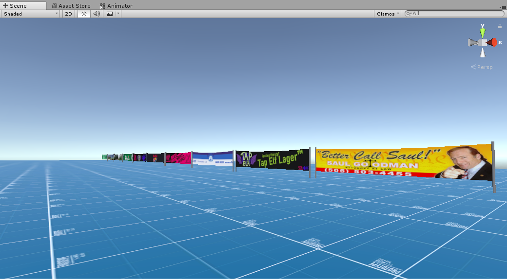
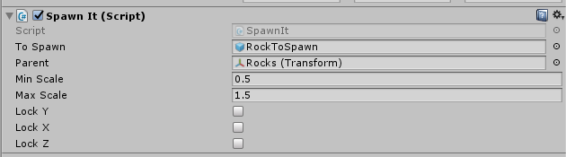

# Descenders Competitive Toolkit

This repository contains many useful scripts as well as a split timer for the game [Descenders](https://store.steampowered.com/app/681280/Descenders/).

Download the latest release [here](https://github.com/nohumanman/descenders-split-timer/releases/tag/main-release)!

## Tools & Features
Note: Most of these feature rely on an external server, *uptime is not guaranteed*.

### Quick reference
- [Split Timer](#split-timer)
- [Speed Trap](#speed-trap)
- [Mod Loader](#mod-loader)
- [Speed Modifier](#speed-modifier)
- [Banners](#banners)
- [Bike Switcher](#bike-switcher)
- [Riders Gate](#riders-gate)
- [Teleport Pad](#teleport-pad)
- [Boundary Tool](#boundary-tool)
- [Cable Tool](#cable-tool)
- [SpawnIt](#spawnit)
- [Implementations](#implementations)

### Split Timer
- Uses checkpoints to show 'splits' (a way of showing of how quick you are relative to your personal best and the world record)
- Has a leaderboard (model courtesy of [BBB171](https://mod.io/g/descenders/u/bbb1711))
- Has the option for [speedrun.com](https://speedrun.com) implementation in the form of a leaderboard (**does not submit times to speedrun.com**)
- Uses 'boundaries' in the form of multiple cubes with IsTrigger enabled - I recommend you use [the boundary tool](#boundary-tool) to make these.

### Speed Trap
A 3D text mesh that displays your speed when you enter a certain trigger - when you aren't in the trigger, it will flash the last detected speed. (Units are displayed in the users' chosent metric)

### Mod Loader
This project is packaged with JubJub's Mod Loader.

### Speed Modifier
- When you enter the Box Collider, the speed of the player is set to that of the "speedToSet" variable you assign.
- Doesn't kill the player.

### Banners
- Banner model courtesy of [RageSquid](https://ragesquid.com/).
-  Banner textures are courtesy of
    - [Toy Elf](https://www.youtube.com/c/ToyElf)
    - [Ovanny](https://www.youtube.com/channel/UCd1LjvaKUITm8WXhnWy_d5A)
    - [BBB171](https://www.youtube.com/channel/UCfOIARENIJQd34lY06SCsiA)
    - myself
- These banner materials use [
Ciconia Studio](https://assetstore.unity.com/packages/vfx/shaders/free-double-sided-shaders-23087)'s double sided shaders.

### Bike Switcher
- Allows you to switch between Hardtail, Downhill, and Enduro bike types.
- UI is enabled when you hold CAPS LOCK key.

### Riders Gate
- A BMX-Style start gate.
- **Synced with other networked players**.
- Has audio accompaniment for auditory queues.
- When 'G' is pressed, the gate is opened permanently.

### Teleport Pad
- Gives you the ability to teleport players using a box collider.
- Gives you the ability to freeze the player on teleport unlike many conventional teleporter scripts.

### Boundary Tool
1. Place cubes along your trail
2. Press "Spawn Boundaries"
3. Boundaries will spawn between the cubes

Special thanks to [antgrass](https://mod.io/g/descenders/u/antgrass) for suggesting this feature.

### Cable Tool
A tool that allows you to select multiple gameobjects, in sequence, and that will spawn objects between those selected gameobjects when you press "*Spawn based on selection*"

### SpawnIt
A tool for quick placement of prefabs with variable scale and rotation (Note: *only works at runtime* - to save changes, copy all modifications, exit play mode, and paste and save)

## Implementations
This timer is implemented, to some capacity, on 
- **[Igloo Bike Park](https://mod.io/g/descenders/m/igloo-bike-park)** by *[antgrass](https://mod.io/g/descenders/u/antgrass)* (50K+ downloads)
- **[Montcerf](https://mod.io/g/descenders/m/montcerf)** by *[antgrass](https://mod.io/g/descenders/u/antgrass)*
- **[Hedgecock](https://mod.io/g/descenders/m/hedgecock)** by *[antgrass](https://mod.io/g/descenders/u/antgrass)*
- **[4x Dobrany](https://mod.io/g/descenders/m/4x-dobrany)** by *[BBB1711](https://mod.io/g/descenders/u/bbb1711)*
- **Ced's Downhill Park (unpublished)** by *[antgrass](https://mod.io/g/descenders/u/antgrass)*
- **[Igloo Bike Park](https://mod.io/g/descenders/m/igloo-bike-park)** by *[antgrass](https://mod.io/g/descenders/u/antgrass)*
- **[MTB Paradise](https://mod.io/g/descenders/m/mtb-paradise)** by *[KAMUS](https://mod.io/g/descenders/u/kamus)*
- **[Red Bull Hardline 2021](https://mod.io/g/descenders/m/rbhl21)** by *[
BI0S0CK](https://mod.io/g/descenders/u/bi0s0ck)*
- **[MTR BMX Track](https://mod.io/g/descenders/m/mtr-bmx-track)** by *[dragonkiller37](https://mod.io/g/descenders/u/dragonkiller37)*

Special thanks to [antgrass]() and [BBB171]() for play testing and for feature suggestions. Thanks to all map makers who have implemented the Split Timer on their map - it's been really interesting to work with the people who make these great maps.

Feel free to join the [Descenders Competitive Discord Server](https://discord.gg/aqwnkgSxPQ) - this is where races often take place and where the Descenders Competitive discord bot is situated.

