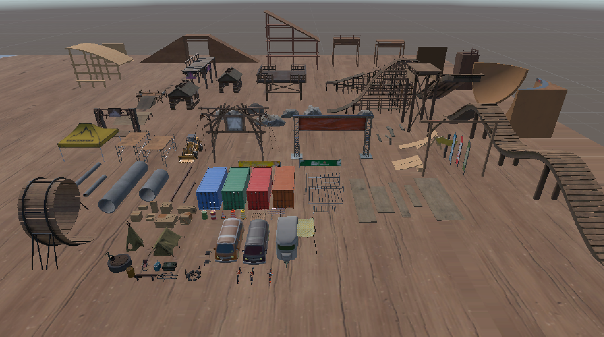

# Descenders Competitive Toolkit

This repository contains scripts, assets, and a server-controlled split timer to mod game [Descenders](https://store.steampowered.com/app/681280/Descenders/).

## Wiki

For installation details on using each feature, or for general problems & FAQs, go to the [Descenders Modding Wiki](https://github.com/nohumanman/descenders-modding/wiki)

## Installation

- Download the latest [Descenders Modding Toolkit Release](https://github.com/nohumanman/descenders-split-timer/releases/tag/main-release)
- or [Download Assets Directly](/unity-project/Assets/)

Please [see the wiki]() for information on how to use features in this toolkit.

Please see the [contributions list](/Contributions.md) for all peoples that have contributed to this project.

## Implementations
This timer is implemented, to some capacity, on 
- **[Igloo Bike Park](https://mod.io/g/descenders/m/igloo-bike-park)** by *[antgrass](https://mod.io/g/descenders/u/antgrass)* (70K+ downloads)
- **[Montcerf](https://mod.io/g/descenders/m/montcerf)** by *[antgrass](https://mod.io/g/descenders/u/antgrass)*
- **[Hedgecock](https://mod.io/g/descenders/m/hedgecock)** by *[antgrass](https://mod.io/g/descenders/u/antgrass)*
- **[4x Dobrany](https://mod.io/g/descenders/m/4x-dobrany)** by *[BBB1711](https://mod.io/g/descenders/u/bbb1711)*
- **[Igloo Bike Park](https://mod.io/g/descenders/m/igloo-bike-park)** by *[antgrass](https://mod.io/g/descenders/u/antgrass)* (70K+ downloads)
- **[MTB Paradise](https://mod.io/g/descenders/m/mtb-paradise)** by *[KAMUS](https://mod.io/g/descenders/u/kamus)*
- **[Red Bull Hardline 2021](https://mod.io/g/descenders/m/rbhl21)** by *[
BI0S0CK](https://mod.io/g/descenders/u/bi0s0ck)*
- **[MTR BMX Track](https://mod.io/g/descenders/m/mtr-bmx-track)** by *[dragonkiller37](https://mod.io/g/descenders/u/dragonkiller37)*

## Tools & Features
Note: Most of these feature rely on an external server, *uptime is not guaranteed*.

### Quick reference
- [Split Timer](#split-timer)
- [Teleport Pad](#teleport-pad)
- [Mod Loader](#mod-loader)
- [Assets](#assets)

### Split Timer
- Uses checkpoints to show 'splits' (a way of showing of how quick you are relative to your personal best and the world record)
- Has a leaderboard (model courtesy of [BBB171](https://mod.io/g/descenders/u/bbb1711))
- Has the option for [speedrun.com](https://speedrun.com) implementation in the form of a leaderboard (**does not submit times to speedrun.com**)
- Uses 'boundaries' in the form of multiple cubes with IsTrigger enabled - I recommend you use [the boundary tool](#boundary-tool) to make these.

### Mod Loader
This project is packaged with JubJub's Mod Loader.

### Teleport Pad
- Gives you the ability to teleport players using a box collider.
- Gives you the ability to freeze the player on teleport unlike many conventional teleporter scripts.

### Assets
